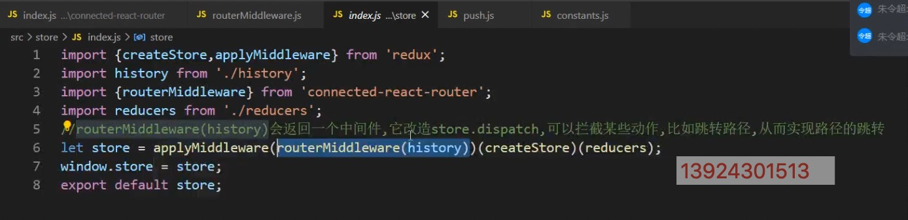

## CONNECT

---

#### 1. 生成项目并且安装模块

- [connect-react-router](https://www.npmjs.com/package/connected-react-router)

> create-react-app connect-react <br/> cd connect-react <br/> npm i react-router-dom redux react-redux connect-react-router -S

#### 2. 作用

1. 核心是实现路由和 `redux` 仓库的同步
2. 可以在 `action` `creator` 里面通过派发动作的方式跳转路径
3. 页面路径发生变化的时候，把路由信息放到仓库中去

#### 3. api 介绍

> `import { connectRouter, ConnectedRouter } from 'connected-react-router` <br>

> `push` : 派发路径变化的 action <br>

> `routerMiddleware` : 是接受此 action，跳转路径 <br>

> `connectRouter` : 当路径发生变化的时候，会向仓库派发一个动作，要求改变仓库的路径变化！ 由谁更改？就由 `connectRouter` 来修改的。 <br>

> `ConnectedRouter` : 作为监听路径的变化，一旦发生变化之后就会派发一个动作给仓库，把最新的路径发送给仓库，从而修改仓库中的状态。 <br>

```js
// constants.js (都是action.type)

export const CALL_HISTORY_METHOD = "@@router/CALL_HISTORY_METHOD";
export const LOCATION_CHANGE = "@@router/LOCATION_CHANGE";
```

```js
// push.js
import { CALL_HISTORY_METHOD } from "./constants";

export default function (path) {
  return {
    type: CALL_HISTORY_METHOD, // 调用历史方法
    payload: {
      // 携带的数据
      method: "push",
      path,
    },
  };
}
```



```js
// routerMiddleware.js

import { CALL_HISTORY_METHOD } from "./contants";

export default function routerMiddleware(history) {
  return function (middlewareApi) {
    return function (next) {
      // next => 相当于原生的store.dispatch
      return function (action) {
        // 改造后的 dispatch 方法
        // 👇 如果不是这个action类型，说明归这个中间件管，不做任何处理
        if (action.type !== CALL_HISTORY_METHOD) {
          return next(action);
        }
        let { method, path } = action.payload;
        history[method](path);
      };
    };
  };
}
```

```js
// ConnectedRouter.js

import React from "react";
import { Router } from "react-router";
import { LOCATION_CHANGE } from "./contants";
import { ReactReduxContext } from 'react-redux'

export default class ConnectedRouter extends React.Component {
  const contextType = ReactReduxContext
  componentDidMount() {
    this.unListen = this.props.history.listen((location, action) =>{
      this.contextType.store.dispatch({
        type: LOCATION_CHANGE,
        payload: {
          location, action
        }
      })
    })
  }

  componentWillUnmount(){
    this.unListen()
  }

  render() {
    const { history, children } = this.props;
    return <Router history={history}>{children}</Router>;
  }
}
```

```js
// connectRouter.js
import { LOCATION_CHANGE } from "./constants";

export default function connectRouter(history) {
  let initialState = { location: history.location, action: history.action };
  return function (state = initialState, action) {
    if (action.type === LOCATION_CHANGE) {
      return {
        location: action.payload.location,
        action: action.payload.action,
      };
    } else {
      return state;
    }
  };
}
```

## [CONNECT](./README-connect.md)

## [Immutable](./README-immutable.md)
