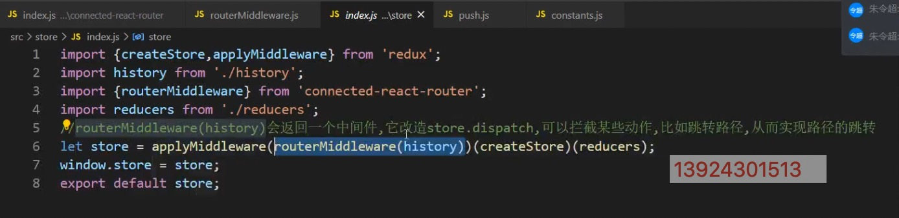

# Getting Started with Create React App

### 1. createElement

### 2. ReactElement

ReactElement 是通过 createElement 创建，调用改方法需要传入三个参数：

- type ReactElement 类型
- config style / className 等
- children

```js
export function createElement(type, config, children) {
  // 处理逻辑
  return ReactElement(
    type,
    key,
    ref,
    self,
    source,
    ReactCurrentOwner.current,
    props
  );
}

export function ReactElement(type, key, ref, self, source, owner, props) {
  const element = {
    // 标记React元素类型
    $$typeof: REACT_ELEMENT_TYPE,
    // react内置属性
    type,
    key,
    ref,
    self,
    source,
    // 记录负责创建此元素的组件
    _owner: owner,
    props,
  };
  return element;
}
```

### 8. useLayoutEffect

- 其函数签名与`useEffect`相同，但是他会在所有的 DOM 变更之后同步调用 Effect
- 可以使用`useLayoutEffect`来读取 DOM 布局，并同步触发重渲染
- 在浏览器执行绘制之前，`useLayoutEffect`内部的更新计划将被同步执行
- 尽可能的使用标准的 ·useEffect·以避免阻塞试图更新

### 9. 自定义 Hook

- 有时候我们想要在组件之间复用一些状态逻辑
- 自定义 Hook 可以让你在不增加组件的情况下达到相同的目的
- Hook 是一种复用状态的逻辑方式，他不服用 state 本身，事实上 Hook 的每次调用都有一个完全独立的 state
- 自定义的 hook 更新是一种约定，而不是一种功能，如果函数的名字一 use 开头，并且调用了其他的 hook，则称为自定义 Hook

## Sage

```js
function run (sage) {
  let it = sage()
  functio next(val) {
    let {value, done} = it.sage()
    if (!done) {
      next(value)
    }
    next()
  }
}

function * sage () {
  let val01 = yield 1
  console.log('val 1', val01)
  let val02 = yield 1
  console.log('val 2', val02)
}
```

# CONNECT

---

#### 1. 生成项目并且安装模块

- [connect-react-router](https://www.npmjs.com/package/connected-react-router)

> create-react-app connect-react <br/> cd connect-react <br/> npm i react-router-dom redux react-redux connect-react-router -S

#### 2. 作用

1. 核心是实现路由和 `redux` 仓库的同步
2. 可以在 `action` `creator` 里面通过派发动作的方式跳转路径
3. 页面路径发生变化的时候，把路由信息放到仓库中去

#### 3. api 介绍

> `import { connectRouter, ConnectedRouter } from 'connected-react-router` <br>

> `push` : 派发路径变化的 action <br>

> `routerMiddleware` : 是接受此 action，跳转路径 <br>

> `connectRouter` : 当路径发生变化的时候，会向仓库派发一个动作，要求改变仓库的路径变化！ 由谁更改？就由 `connectRouter` 来修改的。 <br>

> `ConnectedRouter` : 作为监听路径的变化，一旦发生变化之后就会派发一个动作给仓库，把最新的路径发送给仓库，从而修改仓库中的状态。 <br>

```js
// constants.js (都是action.type)

export const CALL_HISTORY_METHOD = "@@router/CALL_HISTORY_METHOD";
export const LOCATION_CHANGE = "@@router/LOCATION_CHANGE";
```

```js
// push.js
import { CALL_HISTORY_METHOD } from "./constants";

export default function (path) {
  return {
    type: CALL_HISTORY_METHOD, // 调用历史方法
    payload: {
      // 携带的数据
      method: "push",
      path,
    },
  };
}
```



```js
// routerMiddleware.js

import { CALL_HISTORY_METHOD } from "./contants";

export default function routerMiddleware(history) {
  return function (middlewareApi) {
    return function (next) {
      // next => 相当于原生的store.dispatch
      return function (action) {
        // 改造后的 dispatch 方法
        // 👇 如果不是这个action类型，说明归这个中间件管，不做任何处理
        if (action.type !== CALL_HISTORY_METHOD) {
          return next(action);
        }
        let { method, path } = action.payload;
        history[method](path);
      };
    };
  };
}
```

```js
// ConnectedRouter.js

import React from "react";
import { Router } from "react-router";
import { LOCATION_CHANGE } from "./contants";
import { ReactReduxContext } from 'react-redux'

export default class ConnectedRouter extends React.Component {
  const contextType = ReactReduxContext
  componentDidMount() {
    this.unListen = this.props.history.listen((location, action) =>{
      this.contextType.store.dispatch({
        type: LOCATION_CHANGE,
        payload: {
          location, action
        }
      })
    })
  }

  componentWillUnmount(){
    this.unListen()
  }

  render() {
    const { history, children } = this.props;
    return <Router history={history}>{children}</Router>;
  }
}
```

```js
// connectRouter.js
import { LOCATION_CHANGE } from "./constants";

export default function connectRouter(history) {
  let initialState = { location: history.location, action: history.action };
  return function (state = initialState, action) {
    if (action.type === LOCATION_CHANGE) {
      return {
        location: action.payload.location,
        action: action.payload.action,
      };
    } else {
      return state;
    }
  };
}
```

# Immutable

---

### 1.可共享可改变状态是万恶之源

```js
let objA = { name: "zhangsanfeng" };
let bojB = objA;
objB.name = "9";
console.log(objA.name);
```

### 2. 什么是 Immutable

[Immutable]()

- Immutable data 是一旦创建，就不能被更改的数据。对 Immutable 对象的任何修改、添加、删除操作都会返回一个新的 `Immutable` 对象
- Immutable 实现的原理是 Persistent Data Structure （持久化数据结构），也就是使用数据创建新数据时候，要保证就数据同时可用且不变，同时为了所有节点都复制一遍带来的性能消耗。
- Immutable 使用了 Structural Sharing （结构共享），即如果对象树中一个节点发生变化，只修改这个节点和他受影响的节点，其他阶段俄进行共享。

### 3. Immutable 类库

内部实现了一套完整的 Persistent Data Structure，还有很多医用的数据类型。像： `Collection`、`List`、`Map`、`Set`、`Record`、`Seq`

| 方法     | 作用             |
| -------- | ---------------- |
| isMap    | 判断是否是 Map   |
| clear    | 清空值           |
| set      | 设置值           |
| delete   | 删除值           |
| update   | 更新             |
| merge    | 合并             |
| setIn    | 设置值           |
| deleteIn | 删除值           |
| updateIn | 更新值           |
| mergeIn  | 合并             |
| get      | 获取值           |
| getIn    | 获取值           |
| keys     | key 的数组       |
| values   | values 的数组    |
| entries  | entry 的数组     |
| toJS     | 转成普通 JS 对象 |
| toObject | 转成普通对象     |
| toJSON   | 转成 JSON 对象   |
| toArray  | 转成数组         |
